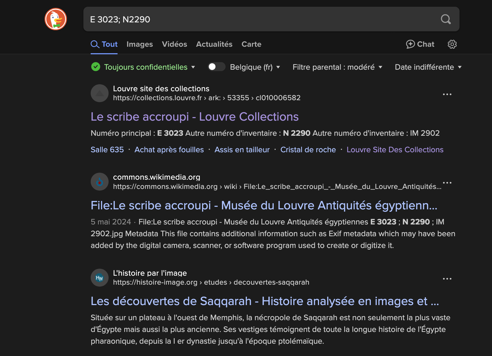
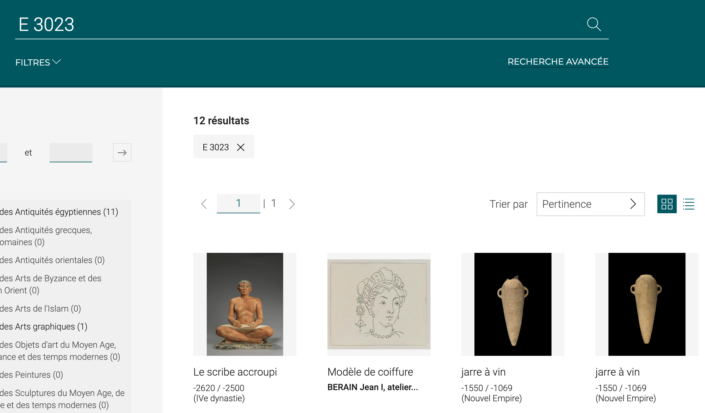
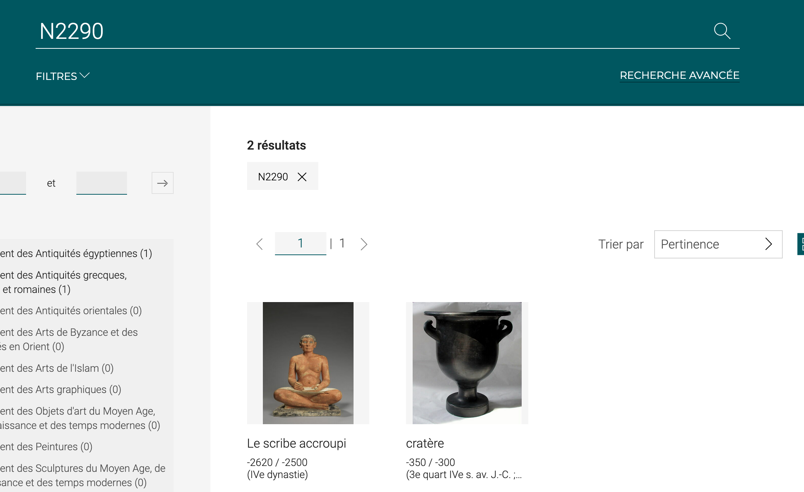
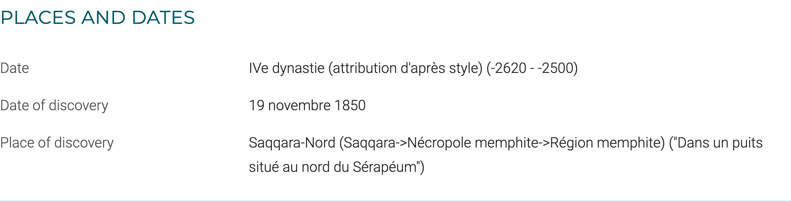

# Coordinates?

There are two ways of doing this:

1. The quickest way is to search the internet for the registration:

https://collections.louvre.fr/en/ark:/53355/cl010006582

If you go to the first link, you will see that the numbers correspond to the inventory numbers of the "Le scribe accroupi".

2. You can also search for the numbers on the [Louvre collections website](https://collections.louvre.fr/recherche?q=):

The same applies to the "Le scribe accroupi".

If you scroll down, you'll find the place where the work was discovered, i.e. Saqqara-North.

Flag: DVCTF{Saqqara-Nord}
