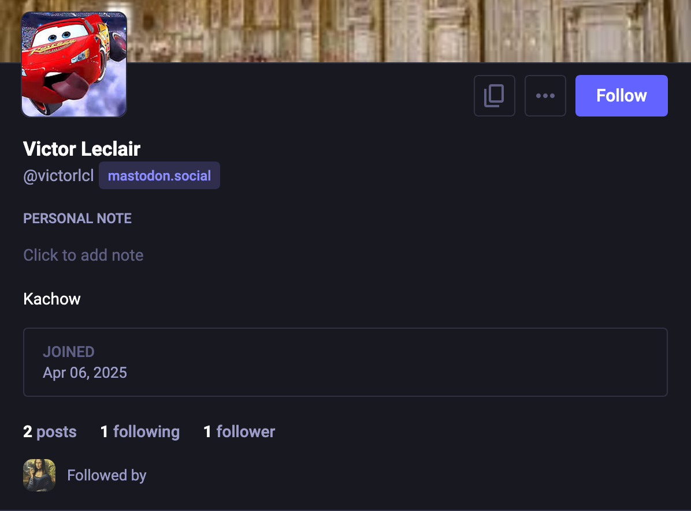
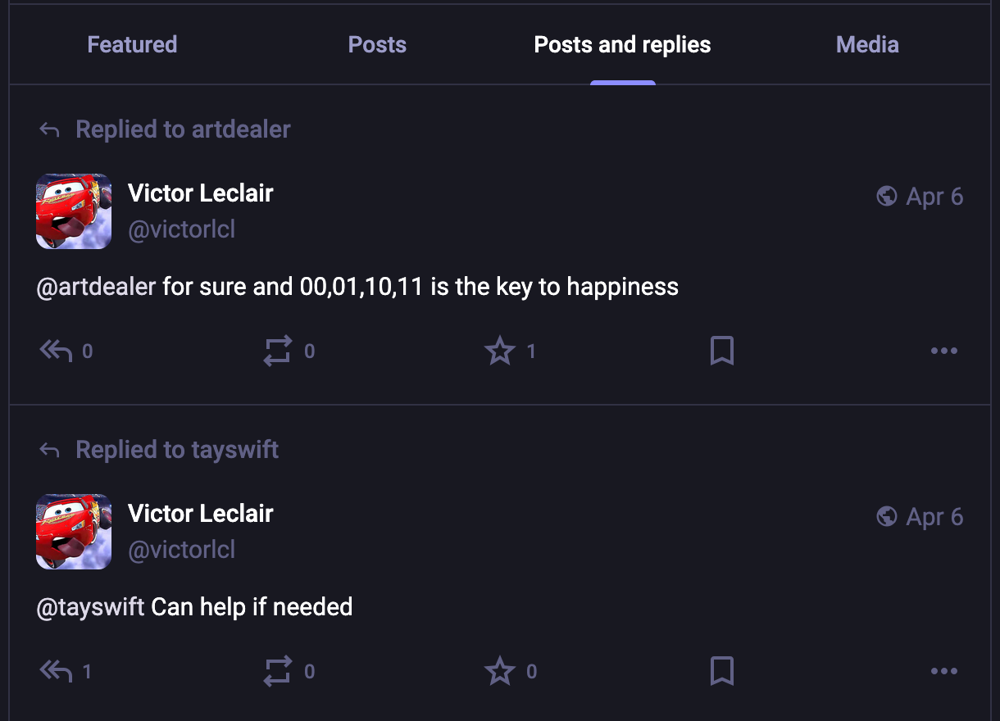
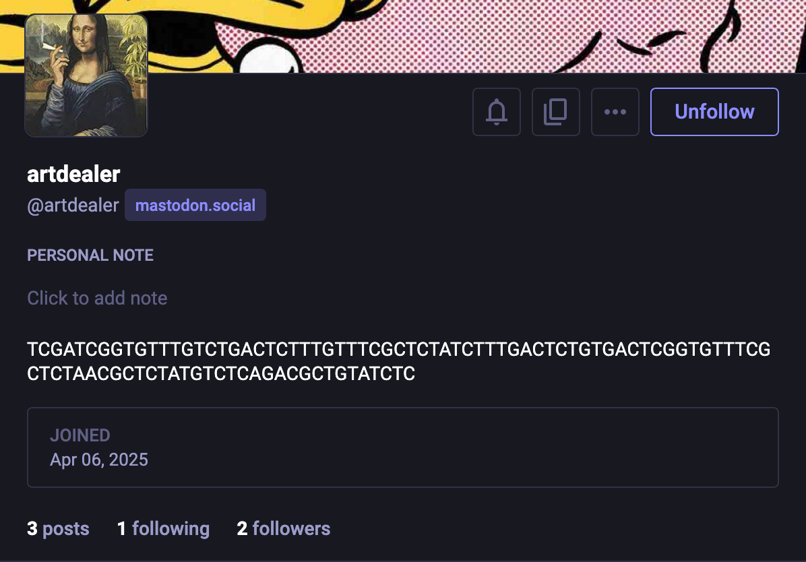
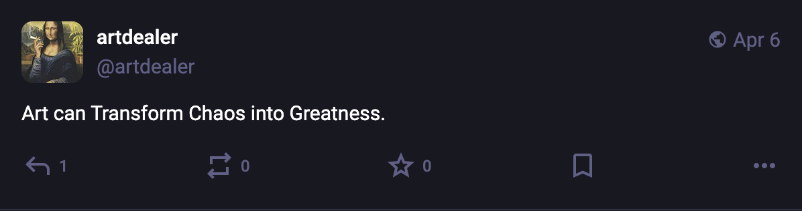
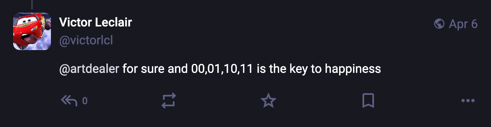
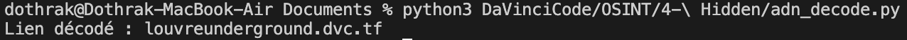

# Hidden

## Who is Victor Leclar?
Here we are given the name of one of the members, Victor Leclair. The first step is to search for him on various social networks. You can find him on Mastodon:



https://mastodon.social/@victorlcl

If you look at the content he has posted on the network, you can see two interactions:



The one we're interested in is with @artdealer.

When you go to his profile, you notice that his biography is strange:



One of his posts is:



Note that the letters A, T, C and G are in capitals, which are also the letters in his bio. In addition, Victor Leclair commented below:



## Decode

Here we have to decode the message in @artdealer's bio by replacing:
- A by 00
- T by 01
- C by 10
- G by 11

The transformation can be carried out using the following Python code for example:

```python
def decode_dna_sequence(dna_seq):

dna_to_bits = {
'A': '00',
'T': '01',
'C': '10',
'G': '11'
}

binary_string = ''.join([dna_to_bits[base] for base in dna_seq])
chars = [chr(int(binary_string[i:i+8], 2)) for i in range(0, len(binary_string), 8)]

return ''.join(chars)

dna_sequence = 'TCGATCGGTGTTTGTCTGACTCTTTGTTTCGCTCTATCTTTGACTCTGTGACTCGGTGTTTCGCTCTAACGCTCTATGTCTCAGACGCTGTATCTC'

decoded_link = decode_dna_sequence(dna_sequence)

print(f"Lien décodé : {decoded_link}")
```

And we get so the link to the website:



Flag: DVCTF{louvreunderground.dvc.tf}
