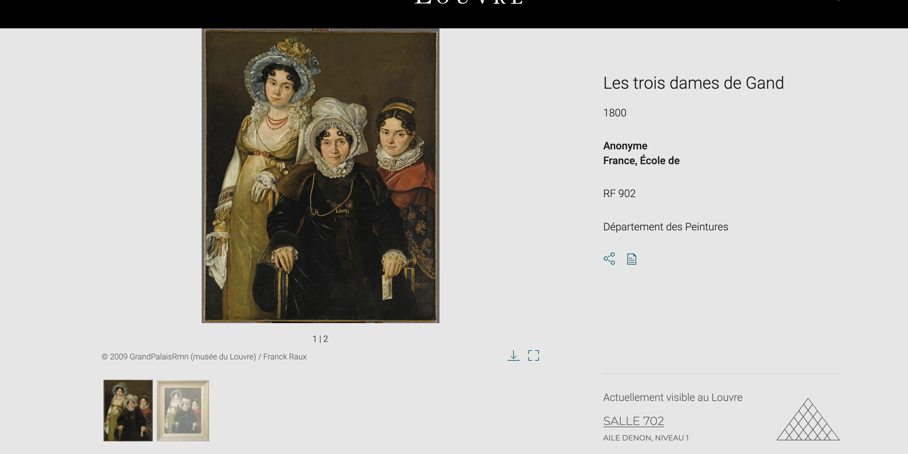
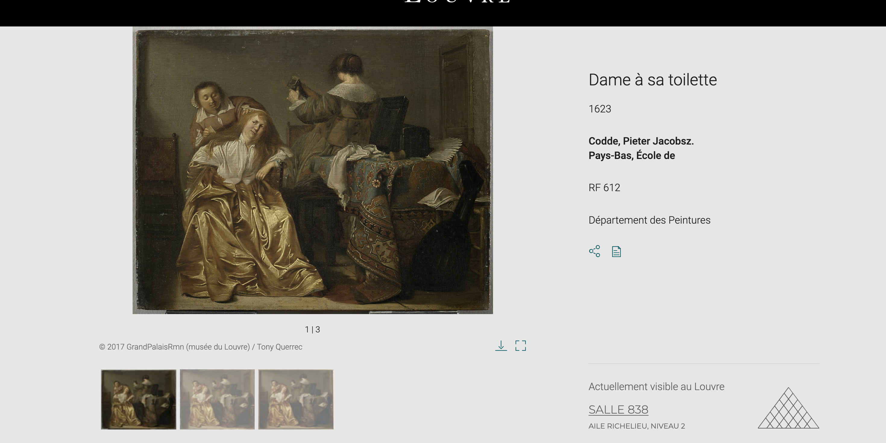
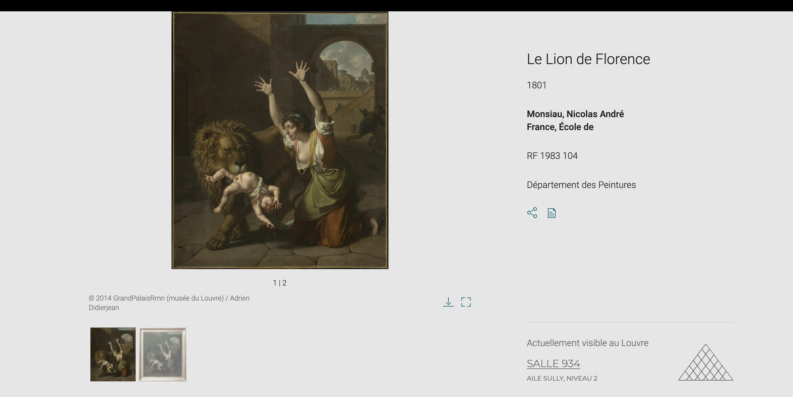

# 2- Prevent

The Louvre provides fact sheets on each of the works it houses. If you use a search engine to enter the name of a work, you will easily come across its web page:

Here we find Les trois dames de Gand in the DENON AILE with the number RF 902:
https://collections.louvre.fr/ark:/53355/cl010059203

Dame à sa toilette (Codde, Pieter Jacobsz) is in the RICHELIEU AILE with the number RF 612:
https://collections.louvre.fr/ark:/53355/cl010063550

And Le Lion de Florence in the SULLY AILE with RF number 1983 104:
https://collections.louvre.fr/ark:/53355/cl010060919

Flag: DVCTF{DENON_RF-902_RICHELIEU_RF-612_SULLY_RF-1983-104}
