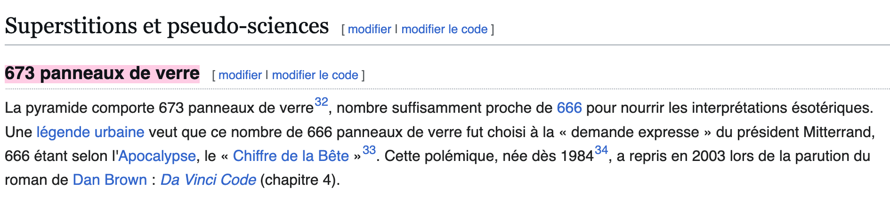
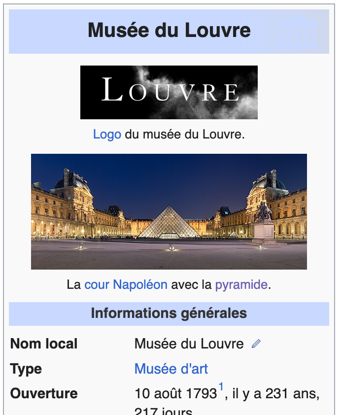
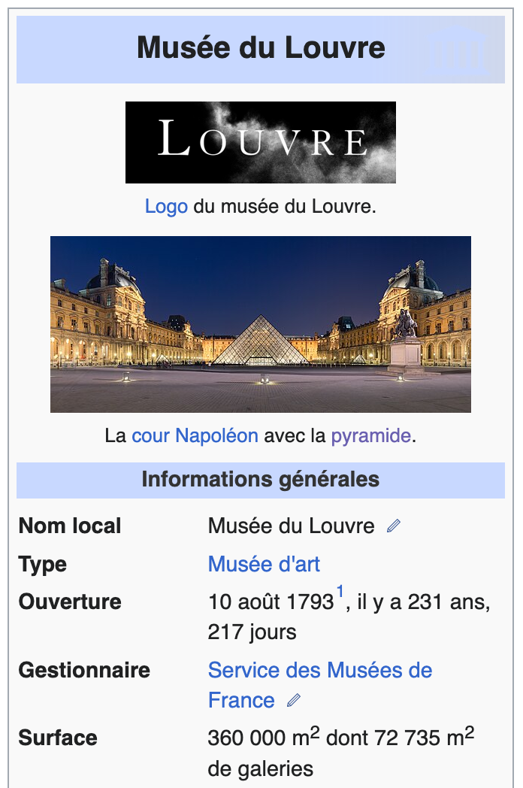
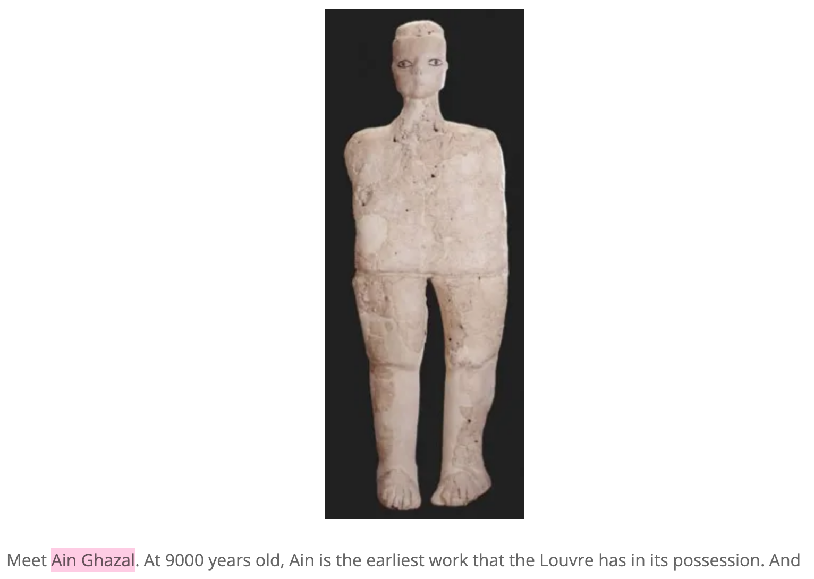

# 1- Reconnaissance

## Panels number
To find out how many glass panels make up the Louvre pyramid, simply visit its Wikipedia page:

https://fr.wikipedia.org/wiki/Pyramide_du_Louvre

## Inauguration month

The same goes for the opening date of the museum:

https://fr.wikipedia.org/wiki/Mus%C3%A9e_du_Louvre

## Area

The total surface area can also be found on the same page:

https://fr.wikipedia.org/wiki/Mus%C3%A9e_du_Louvre

## Oldest piece

To find the oldest work owned by the museum, use a search engine to find "oldest louvre piece of art", and you'll come across several online articles mentioning the Ain Ghazal statue, which dates back more than 9,000 years:

https://thatmuse.com/2013/03/14/discovering-the-oldest-piece-at-the-louvre/
https://museum.travel/louvre-museum-oldest-artifact/

Flag: DVCTF{673_august_360000_ain-ghazal}
